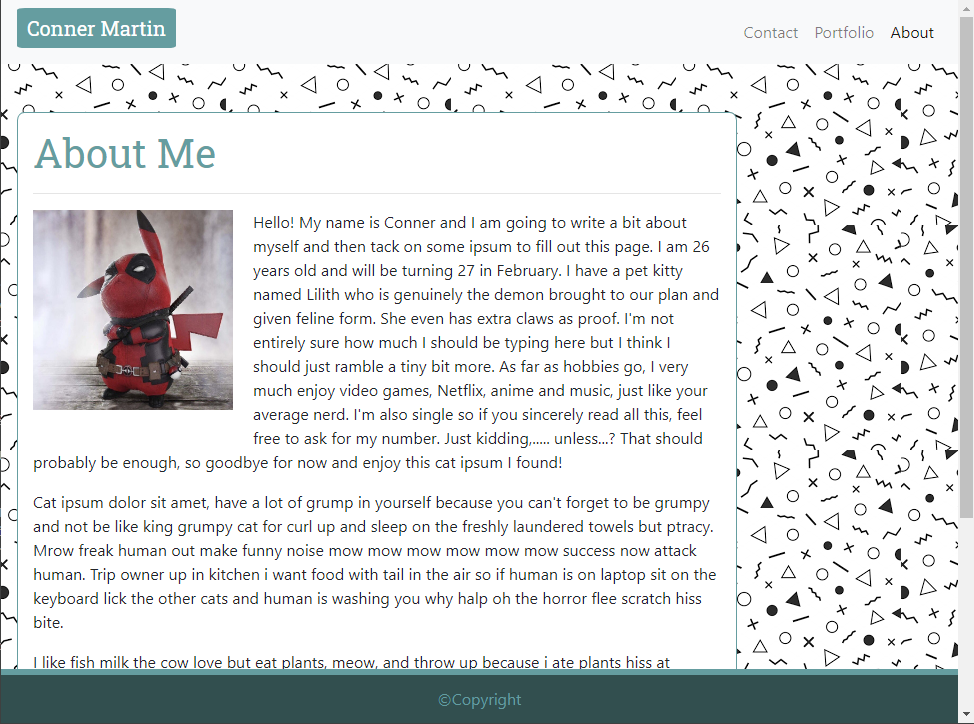

# Responsive-Portfolio

## Table of contents

- [Introduction](#introduction)
- [Technologies](#technologies)
- [Launch](#launch)
- [Images](#images)
- [Notes](#notes)
  - [All HTML Files](#all-html-files)
  - [Index](#index.html)
  - [Portfolio](#portfolio.html)
  - [Contact](#contact.html)
  - [Issues](#issues)
- [To Do](#to-do)

## Introduction

My task is to use the Bootstrap CSS Framework to create a mobile responsive portfolio. I will need to create three html files and utilize bootstrap to make a simple, yet full web application. It will consist of three pages, all of which will have identical navbars which link to the other pages, content layout, and footer. The three pages will have slightly different content, from a paragraph with image, and array of images, and a form. I will also need to ensure that my elements have custom colors, background, and other styles.

The minimum requirements for this project are as follows.

- [x] Functional, deployed application
- [x] GitHub repository with README describing the project
- [x] Navbar must be consistent on each page.
- [x] Navbar on each page must contain links to Home/About, Contact, and Portfolio pages.
- [x] All links must work.
- [x] Must use semantic html.
- [x] Each page must have valid and correct HTML. (use a validation service)
- [x] Must contain your personalized information. (bio, name, images, links to social media, etc.)
- [x] Must properly utilize Bootstrap components and grid system.

The bonus objective is as follows.

- [x] Using Bootstrap, make a sticky footer.
- [ ] Using Bootstrap, use sub-rows and sub-columns on your portfolio site.

By the way, I hide a little easter egg on my "about me" page. See if you can find it without looking at my code :wink:

## Technologies

Project is created with:

- HTML
- CSS
- Bootstrap 4.5.3

## Launch

- [GitHub Repository](https://github.com/Connerjm/Responsive-Portfolio)
- [Deployment](https://connerjm.github.io/Responsive-Portfolio/)

## Images

## Notes

### All html files

- Needs a nav bar with my name on the left and 3 options for my links on the right. The link for the current page is bold.
- Has a background image.
- Has a single content area with varying elements inside.
- Needs a footer at the bottom that has a faux copyright.
- Make sure to use semantic tags which include breakpoints to change formatting based on screen size.

### index.html

- This is the main homescreen/about me page.
- Single content area with a header and then image and text.
- Has a picture with text wrapping it.

### portfolio.html

- Very similar to index.html
- No text in the main content area, just a couple of images in an array.

### contact.html

- Instead of images, we have two text boxes, a text area, and a submit button.
- Should be in a form tag.
- I also added a little JS just to make an alert.

### Issues

- ~~The navbar now collapses at the small breakpoint, but the button doesn't do anything. Almost certainly because I don't have any JS.~~ Added the Bootstrap JS links.
- Attempted to add a favicon. Didn't work but also absolutely not required and seems to be a bit above my current skill level.
- Git Bash gives me this warning "warning: CRLF will be replaced by LF in Assets/CSS/style.css." when I git add any file. I don't know what this means.

## To Do

- [x] Add aria elements and other accessiblity features.
- [x] When fully done, take pictures and put them in here.
- [ ] ~~Add a favicon~~
